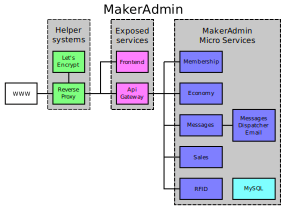

MakerAdmin dokumentation
========================
MakerAdmin - Ett Administrationssystem för Makersverige

MakerAdmin består av ett antal olika moduler som tillsammans hjälper er som driver ett Makerspace att sköta den löpande administrationen, med hantering av medlemsregister, behörigheter, nyckeltaggar, betalningar, utskick & påminnelser samt enklare ekonomihantering.

## Todo dokumentation
**OBS: Det finns mängder med information att uppdatera i denna dokumentation**

* [api-v0.1.raml](API/api-v0.1.raml) är inte uppdaterad på länge
* Uppdatera api-console till 4.x
* Dokumentera [MakerAdmin-Hub](https://github.com/makerspace/MakerAdmin-Hub)
* [Microservices.md](Microservices) stämmer ej överens med verkligheten
* [CONTRIBUTING.md](CONTRIBUTING.md) är icke existerande + att länkning ej fungerar
* [GDPR.md](GDPR) är icke existerande
* [todo.txt](todo.txt) är inte länkad och dessutom inte uppdaterad på evigheter. Bör nog skyfflas in i [Roadmap.md](Roadmap)
* [chille](https://github.com/chille) har en hel del grejer som behöver commitas
* Det finns nog en del dokumentation i andra repositories som antingen kan flyttas hit, eller tas bort helt och hållet

## Översikt

MakerAdmin är ett IT-stödsystem för att underlätta administration i Makerspace eller annan liknande organisation. Systemet är tänkt att erbjudas som en tjänst på nationell nivå. Självklart är systemet open source och går enkelt att sätta upp på en egen server.

### Micro services
Systemet är uppbyggt på en så kallad "micro services"-arkitektur. Detta innebär i praktiken att man bryter isär ett störra system (monolit) till små inviduella tjänster. Varje micro service ska i största möjliga mån vara fristående från resten av systemet, men kan självklart kommunicera med andra micro services. På så vis kan en utvecklare eller ett team fokusera på en modul och det blir sedan enkelt att driftsätta den som en del av systemet.

Det finns många olika moduler i MakerAdmin. Se [Microservices.md](Microservices) för en komplett lista

## MakerAdmin's framtid
Läs mer i [Roadmap.md](Roadmap)

## Information rörande GDPR

MakerAdmin strävar efter att vara kompatibel med GDPR och förenkla arbetet för styrelsen. Läs mer i [GDPR.md](GDPR)

## API-dokumentation

All API-dokumentationen finns i en så kallad [RAML](http://en.wikipedia.org/wiki/RAML_(software))-fil. Denna fil går att visa online med en Javascript-baserad RAML-viewer som heter [api-console](https://github.com/mulesoft/api-console).

[api-v0.1.raml](API/api-v0.1.raml)

[Interaktiv online-version](API/index.html)

## Behörighetssystem

Läs mer om [behörighetssystemet](Permissions)

## Hur du bidrar till projektet

Läs mer i [CONTRIBUTING.md](CONTRIBUTING)